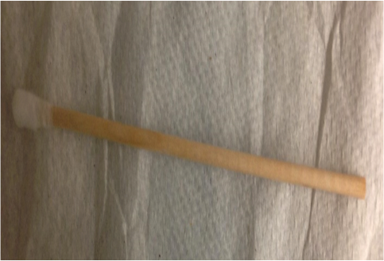
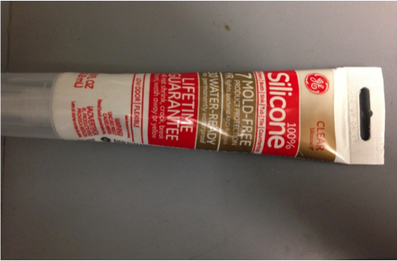
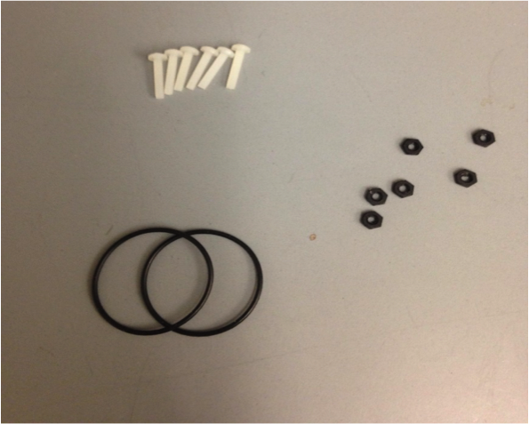
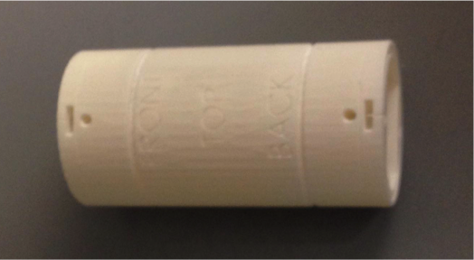
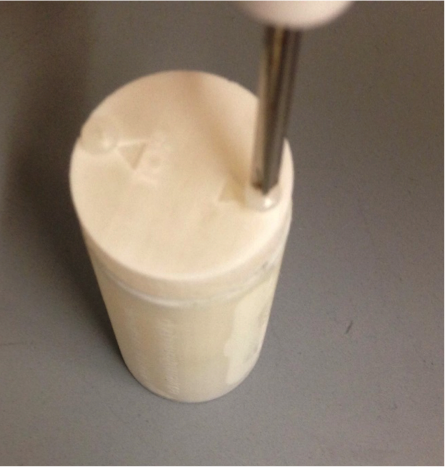

#Mouse Brain Holder Manual v3.0
**By Dong Kyu Kim, dong.kyu.kim@vanderbilt.edu  
PI: Dr. Mark D. Does  
Supported by NIH R01EB019980  
[REMMI Project](https://vuiis.vumc.org/remmi/remmi.php)    
Vanderbilt University and Vanderbilt University Institute of Imaging Science (VUIIS)**

This MRI compatible 3D printed holder can hold up to 4 mouse brains. Designs are available for 20mm, 25mm, 35mm, 38mm, and 40mm coils in SolidWorks (.sldprt) file format. This manual will use pictures of the 4 mouse brain 25mm holder to describe the preparation procedure. The same procedure is used to prepare the other holders.

##Table of Contents
Parts List..........................................2  
Holder Printing and Washing...........3  
Holder Orientation............................4  
O-ring and Hex Nut Placement........4  
Air Bubble Trapping..........................5  
Capping............................................5  
Holder Preparation...........................6  
Tight Fitting	......................................8

1

##Parts List

3D printed parts are highlighted in **bold text** throughout the manual. Parts were printed with 3D systems Projet 3500 HDMax at UHD mode with VisiJet M3 Crystal material. Minimum parts required:

1. 1x **Holder**
2. 2x **Cap1**
3. 4x **Sled**
4. 1x **Sled** (used for 1 mouse brain holder)
5. 1x **Separator** (used for 4 and 6 mouse brain holders)

2

A long Q-tip is recommended for pushing mouse brains in and out of the holder. 100% silicone is required for sealing certain features of the holder where potential leakage may occur.

Misc. Parts from McMaster-Carr:  
See Github README files for parts list and where to acquired O-rings, nylon hex nuts, and nylon screws.

##Holder Printing and Washing
3D printing should be done in UHD mode on Projet 3500 HDMax or a printer capable of achieving similar resolution (34x34x29 µm) to ensure proper printing of fine features. After printing, parts should be placed in oven at 62°C for minimum of 3 hours to melt off support material. A heated ultrasonic cleaner filled with mineral oil should be used to remove residual support material in fine spaces in the holder. 1 hour in 62°C oil bath is sufficient. Rinse off oil with soap and water thoroughly and let dry for 1 hour.  [A thin bristle set](https://www.mcmaster.com/7396T71) should be used to scrape through small features in the holder, particularly O-ring grooves and screw holes. Place all parts in a glass jar filled with hexane, ensuring that the parts are fully submerged. Leave in hexane for 1 day. Take parts out and use bristles again to scrape through the holder. Leave to dry for 1 hour. Parts should now be ready to use for scanning.

3

##Holder Orientation

See text on **Holder** to determine the correct orientation. The "FRONT" side goes into the magnet first. The "TOP" side must face the ceiling.

##O-ring and Hex Nut Placement

Left: Place the O-ring in the “FRONT” and “BACK” groove of the **Holder**. Firmly press down evenly around the ring and remove any kinks. This is important for preventing fluid leakage.  
Right: Place the hex nuts in the grooves of the **Holder**. There are 4 hex nut holes on the outer surface of the holder (2 in front, 2 in back). Place the hex nuts in so that the flat edge of the nut faces the outward. There are 2 hex nut holes in the interior of the holder (1 in each end). Place the hex nut in appropriately and **seal these holes with a layer of silicone.**

4

##Air Bubble Trapping

Undesirable air bubbles within the **Holder** can be trapped away from mouse brains by rotating the holder 360°. Start with the “BACK” end facing the ceiling, then rotate to the “BOTTOM” facing up, then “FRONT” end, then “TOP” facing the ceiling.

##Capping
While screwing in the cap, apply some downward pressure on the cap with your thumb to ensure proper O-ring sealing between the cap and the holder surfaces.

5

##Holder Preparation
Start with capping the "FRONT" end of the holder.  
Brains should insert such that the frontal lobe of the brain inserts first. The top of the brain should be facing the “top” of the holder. Insert brains from the “back” end, and push toward the “front” end. The interior of the holder has 4 shaped grooves that help to align the brains parallel to the length of the holder.
  
Start by inserting two brains at the “BOTTOM” of the holder. Use a long q-tip to help guide the brains down. You may need to rotate the brains a little initially to get them into the holder.
  
Insert the remaining two brains at the “top” of the holder, again using a long q-tip to guide the brains down. Ensure the four brains are all aligned parallel along the length of the holder.

6

Insert **Separator** in the middle groove all the way until it cannot be pushed further. For all designs, the **Separator** serves to separate adjacent rows of compartments.
  
Insert **Sled** in the T-shaped grooves and the trapezoidal grooves in the middle sled. For some designs, the **Sled** is a flat piece kind of like the separator, but all sleds serve to keep the brains situated in the middle of the holder. Use the grooves as guides to move the sled down until it is flush up against the mouse brain. Pipette imaging solution of choice (i.e. Fomblin) until the holder is completely filled with the solution.
  
Screw on cap on the “BACK” end, again applying downward pressure on the cap while screwing. If the holder leaks at this point, silicone may be applied at the interface between the cap and holder.

7

##Tight Fitting
This design features additional O-ring grooves on the outer surface that can help facilitate tighter fitting within the RF coil. The exact dimensions of the O-ring will vary depending on RF coil diameter and dimensional tolerances. Alternatively, a few wounds of tape can be used instead to fill any gaps between the holder and RF coil.

